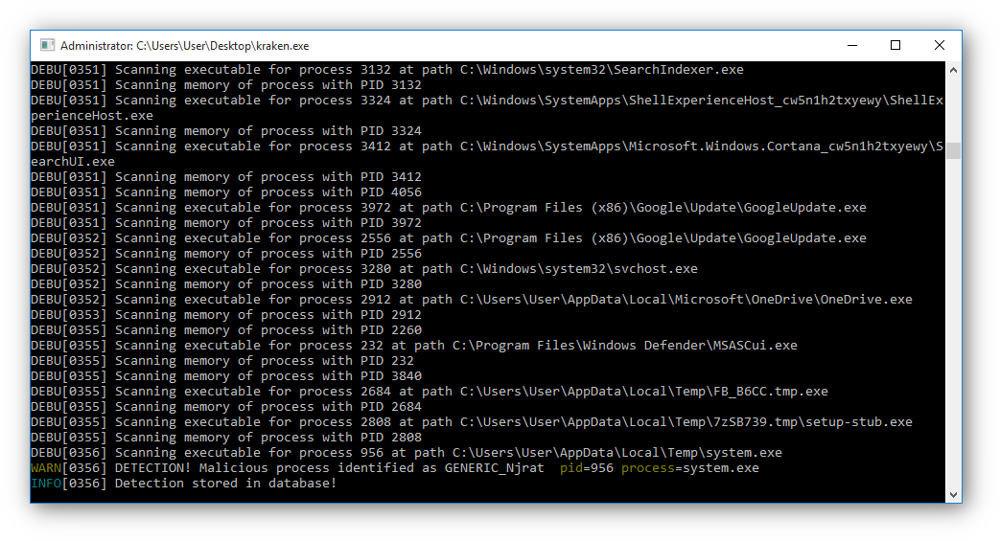
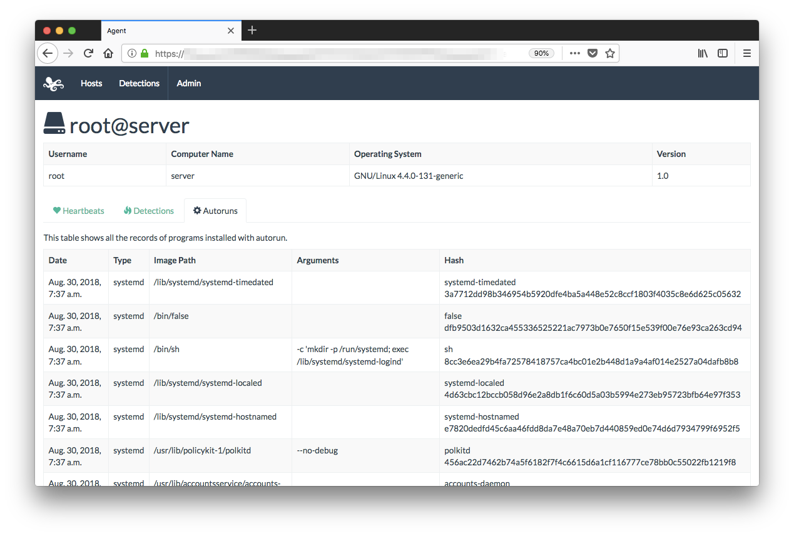
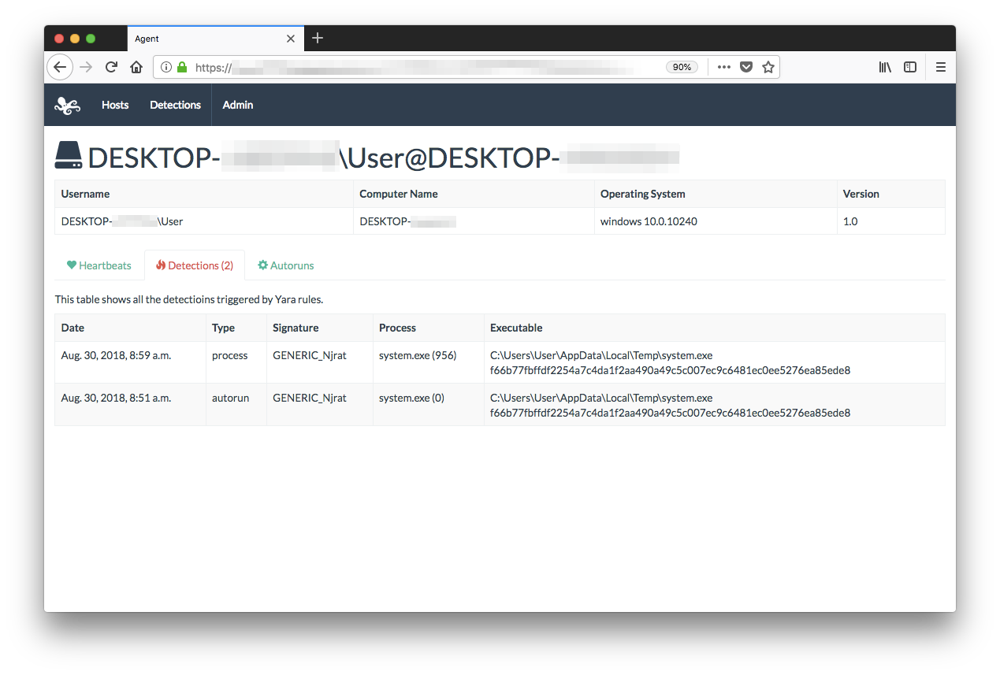

Kraken is a simple cross-platform Yara scanner that can be built for Windows, Mac, FreeBSD and Linux. It is primarily intended for incident response, research and ad-hoc detections (*not* for endpoint protection). Following are the core features:

- Scan running executables and memory of running processes with provided Yara rules (leveraging [go-yara](https://github.com/hillu/go-yara)).
- Scan executables installed for autorun (leveraging [go-autoruns](https://github.com/botherder/go-autoruns)).
- Report any detection to a remote server provided with a Django-based web interface.
- Run continuously and periodically check for new autoruns and scan any newly executed process. Kraken will store events in a local SQLite3 database and will keep copies of autorun and detected executables.

Some features are still under work or almost completed:

- Installer and launcher to automatically start Kraken at startup.
- Download updated Yara rules from the server.

## Table of Contents

* [Screenshots](#screenshots)
* [How to use](#how-to-use)
    * [Configuration](#configuration)
* [Installing the Web Interface](#installing-the-web-interface)
* [Building](#building)
    * [Building on Linux](#building-on-linux)
    * [Building on FreeBSD](#building-on-freebsd)
    * [Cross-compiling Windows binaries](#cross-compiling-windows-binaries)
* [License](#license)

## Screenshots







## How to use

Once the binaries are compiled you will have a `kraken-launcher` and an `kraken` in the appropriate platform build folder.

`kraken` can be launched without any argument and it will perform a scan of detected autorun entries and running processes and terminate. It will not communicate any results to any remote server.

Alternatively, `kraken` can also be launched using the following arguments:

    Usage of kraken:
          --backend string   Specify a particular hostname to the backend to connect to (overrides the default)
          --daemon           Enable daemon mode (this will also enable the report flag)
          --debug            Enable debug logs
          --report           Enable reporting of events to the backend

Using `kraken --backend example.com` will override the default `BACKEND` that was provided during build time.

Using `kraken --report` will make Kraken report any autoruns or detections to the configured backend server.

Launching `kraken --daemon` will execute a first scan and then run continuously. In *daemon* mode Kraken will monitor any new process creation and scan its binary and memory, as well as check regularly for any new entries registered for autorun. Enabling `--daemon` will automatically enable `--report` as well, even when not explicitly specified.

Enabling the `--debug` will only display all debug log messages, mostly including details on files and processes being scanned.

### Configuration

When `kraken` is launched in *daemon* mode it will look for a configuration file either in the current working directory or in the persistent directory. This configuration file is moslty used to lookup the hostname of the backend Kraken will have to connect to. If a configuration file does not exist, it will create one using the default parameters provided during build time (primarily `BACKEND`).

If `kraken` is launched in normal mode, it will still look for any configuration file, but it will not write one to disk in case there isn't any. If no configuration file is found, it will use the default parameters provided provided during build time (again, `BACKEND`).

To provide it different parameters you can either create a `config.yaml` file in the same directory as the `kraken` binary using the followiing format:

```yaml
base_domain: <value>
```

Or you can also specify a custom backend from the command line using `kraken --backend example.com`.


## Installing the Web Interface

The web interface is built using Django. You can run it using Python 3, which will require the following dependencies:

    $ sudo apt install python3 python3-dev python3-pip python3-mysqldb
    $ sudo pip3 install Django python-decouple django-geoip2-extras

To configure your Krakan Django app, instead of modifying `server/settings.py` you can create a file named `.env` inside the `server/` folder with the following content:

```shell
SECRET_KEY=your_secret_key
DEBUG=True
DB_NAME=kraken
DB_USER=user
DB_PASSWORD=pass
STATIC_ROOT=/home/user/kraken/server/static/
GEOIP_PATH=/home/user/geoip/
```

Change those values appropriately. The `GEOIP_PATH` variable should point to a folder containing [MaxMind GeoLite2 City](https://dev.maxmind.com/geoip/geoip2/geolite2/) database.

If you want to run the server using Gunicorn, you can install it with:

    $ sudo pip3 install gunicorn

You can create a Gunicorn systemd service creating a `kraken.service` file in `/etc/systemd/system` like the following:

    Description=Gunicorn Application Server handling Kraken Servers
    After=network.target

    [Service]
    User=user
    Group=www-data
    WorkingDirectory=/home/user/kraken/server/
    ExecStart=/usr/local/bin/gunicorn --workers 3 --bind unix:/home/user/kraken-server.sock server.wsgi:application
    Restart=always

    [Install]
    WantedBy=multi-user.target

You can then configure your webserver to proxy requests to the unix socket at `/home/user/kraken-server.sock`.

## Building

In order to build Kraken you will need to have Go installed on your system. We recommend using Go >= 1.11 in order to leverage the native support for Go Modules (if it is not available in your package manager, you can use something like [gvm](https://github.com/moovweb/gvm)).

Firstly download Kraken:

    $ git clone https://github.com/botherder/kraken.git
    $ cd kraken

Most Go libraries depedencies are available to install through:

    $ make deps

### Building on Linux

You need to install Yara development libraries and headers. You should download and compile Yara from the [official sources](https://github.com/VirusTotal/yara). It will require `dh-autoreconf` installed and you will need to configure some compilation flags. This is most likely the procedure you will need to follow:

    $ sudo apt install dh-autoreconf
    $ wget https://github.com/VirusTotal/yara/archive/v3.8.1.tar.gz
    $ tar -zxvf yara-v3.8.1.tar.gz
    $ cd yara-3.8.1
    $ ./bootstrap.sh
    $ ./configure --without-crypto
    $ make && sudo make install
    $ sudo ldconfig

Compiling Kraken requires to specify a path to a file or a folder that contain the Yara rules you wish to embed with the binary. You can try for example with:

    $ BACKEND=example.com RULES=test/ make linux

### Building on FreeBSD

While cross-compilation of FreeBSD binaries is not available yet, it is possible to build binaries in a native FreeBSD environment. In order to do so you will firstly need to install some packages:

    $ sudo pkg install gmake pkgconf go-bindata

Then you will need to install Yara, which is normally available in [ports](https://www.freshports.org/security/yara/). After moving to `/usr/ports/security/yara`, before installing it is recommended that you modify the file `Makefile` to add `--without-crypto` to `CONFIGURE_ARGS`. If you don't need the Yara modules enabled in the Makefile, feel free to remove them. Now you can proceed with installing:

    $ sudo make && sudo make install

Now you can move to the directory that contains the Kraken source code and build it with:

    $ BACKEND=example.com RULES=test/ gmake freebsd

### Cross-compiling Windows binaries

Cross-compiling Windows binaries from a Linux development machine is a slightly more complicated process. Firstly you will need to install MingW and some other depedencies:

    $ sudo apt install gcc mingw-w64 automate libtool make

Next you will need to download Yara sources. Use the latest available version, which at the time of writing is 3.8.1:

    $ wget https://github.com/VirusTotal/yara/archive/v3.8.1.tar.gz

Unpack the archive and export `YARA_SRC` to the newly created folder:

    $ export YARA_SRC=<folder>

Next you need to bootstrap Yara sources and compile them with MingW. The following instructions are to compile it for **32bit**:

    $ cd ${YARA_SRC}
    $ ./bootstrap.sh
    $ ./configure --host=i686-w64-mingw32 --without-crypto --prefix=${YARA_SRC}/i686-w64-mingw32
    $ make -C ${YARA_SRC}
    $ make -C ${YARA_SRC} install

Now we can download and build `go-yara` for 32bit using the following command:

    $ go get -d -u github.com/hillu/go-yara
    $ GOOS=windows GOARCH=386 CGO_ENABLED=1 \
      CC=i686-w64-mingw32-gcc \
      PKG_CONFIG_PATH=${YARA_SRC}/i686-w64-mingw32/lib/pkgconfig \
      go install -ldflags '-extldflags "-static"' github.com/hillu/go-yara

Now you can compile Kraken using:

    $ BACKEND=example.com RULES=test/ make windows

If you get errors such as ` undefined reference to 'yr_compiler_add_file'` you might need to pass the `PKG_CONFIG_PATH` variable:

    $ PKG_CONFIG_PATH=${YARA_SRC}/i686-w64-mingw32/lib/pkgconfig BACKEND=example.com RULES=test/ make windows

## License

Kraken is released under the [GNU General Public License v3.0](LICENSE) and is copyrighted to [Claudio Guarnieri](https://nex.sx).
